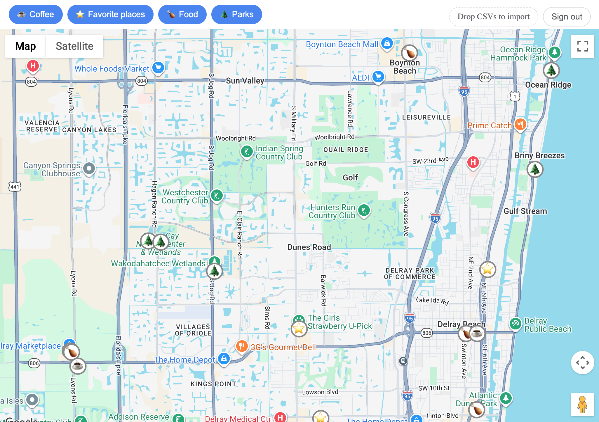

# My Places Explorer

[](https://github.com/yavormilchev/my-places/actions/workflows/ci.yml)

A personal tool for importing Google Maps saved places and browsing them by location and category — not a product.
Single-user by design: no accounts, no multi-tenancy, just me. Full design reasoning and tradeoffs live in
[`docs/project-plan.md`](docs/project-plan.md); the hosting/deployment architecture is in
[`docs/decisions/hosting.md`](docs/decisions/hosting.md).



## A few things worth knowing about how this works

- **Google Maps has no API for a user's saved places.** Every "import my saved places" tool works around that —
  this one starts from a Google Takeout CSV export, since that's the only path that exists.
- **The first coordinate-resolution approach — scraping — turned out not to work**, and not for a vague "it's
  unofficial" reason: a plain unauthenticated request to a Maps place URL returns Google's generic app shell, not
  place-specific data (confirmed by fetching two different real places and finding byte-identical responses).
  Swapped for the Places API instead, without touching anything downstream — coordinate/category resolution was
  built behind one swappable boundary from the start specifically so a wrong bet like that wouldn't be expensive to
  unwind.
- **Turning a saved place's URL into something the Places API accepts required reverse-engineering Google's Place
  ID format** — there's no documented conversion from what Takeout exports. Decoding real Place IDs showed they're
  base64url of a small protobuf message holding the URL's embedded ID as raw bytes — fully local, no API call
  needed, and confirmed against the live API for multiple real places before being trusted.
- **Re-importing doesn't just add places — it reconciles, scoped to the list being imported.** Removing a place
  from a saved list removes it from the database too on the next import of that list, with a safety guard against
  ever treating "the API had a bad day this run" the same as "you actually removed this" — and without touching
  any other list's places in the process.

## Stack

- `/api` — Express 5, TypeScript, Postgres, raw `pg` (no ORM)
- `/web` — Vite, React, TypeScript
- npm workspaces, one repo

## Initial setup

Run these commands in the root folder.

Install dependencies:

```shell
npm install
```

Copy `.env.example` to `.env` and fill in your own values:

- **Database** — `POSTGRES_USER`/`POSTGRES_PASSWORD`/`POSTGRES_DB`, and the matching `DATABASE_URL`/`TEST_DATABASE_URL`.
- **Google Places API** — `GOOGLE_PLACES_SERVER_SIDE_API_KEY` (server-side, resolves coordinates/categories) and
  `VITE_GOOGLE_MAPS_PUBLIC_KEY` (browser-side, renders the map).
- **Google sign-in** — `GOOGLE_OAUTH_CLIENT_ID`/`GOOGLE_OAUTH_CLIENT_SECRET` from a Google Cloud OAuth client, plus
  `GOOGLE_OAUTH_REDIRECT_URI` and `WEB_APP_URL` (the defaults in `.env.example` match local dev as-is).
- **Session** — `SESSION_SECRET` (generate with `openssl rand -hex 32`) and `ALLOWED_EMAIL`, the one Google account
  permitted to sign in.

Provision the DB:

```shell
npm run db:up
```

Create the test database (a separate, disposable database the test suite runs against — see
[`docs/project-plan.md`](docs/project-plan.md) §7):

```shell
docker compose exec postgres createdb -U $POSTGRES_USER my_places_test
```

Run the migrations (both the main and test databases):

```shell
npm run migrate -w @my-places/api -- up
npm run migrate:test -w @my-places/api -- up
```

## Running locally

Provided the DB is already running:

```shell
npm run dev
```

Confirm it's working:

- Web: <http://localhost:5173/>
- API health: <http://localhost:3000/api/health>
- API health, with DB connectivity: <http://localhost:3000/api/db-health>

Sign-in is gated to a single Google account — visiting the web app redirects straight to Google's sign-in flow, and
only the address set as `ALLOWED_EMAIL` can complete it.

## Checks

Run formatting, linting, type-checking, and the test suite together:

```shell
npm run check
```

## How to export your saved places

1. Go to takeout.google.com.
2. Click "Deselect all", then check just "Saved".
3. Continue through the export options (file type .zip, default size limit is way more than enough for this).
4. Create the export — Google emails you when it's done.
5. Download and unzip it. Inside you'll find a Takeout/Saved/ folder containing CSV files for all your saved lists.
6. Some files may be unrelated to Maps Saved Places. Discard them.

## How to import your saved places

**Option 1 — from the web app:** drag and drop the desired CSV files onto the file-drop area. Each file is imported
under its own filename as the list/category name, independent of any other list already imported.

**Option 2 — from the command line:** drop the desired CSV files into `uploads/places/`, then run:

```shell
npm run import -w @my-places/api
```

## License

[MIT](LICENSE)
